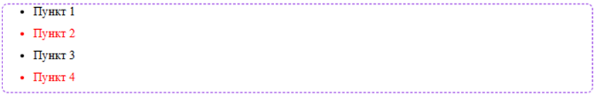
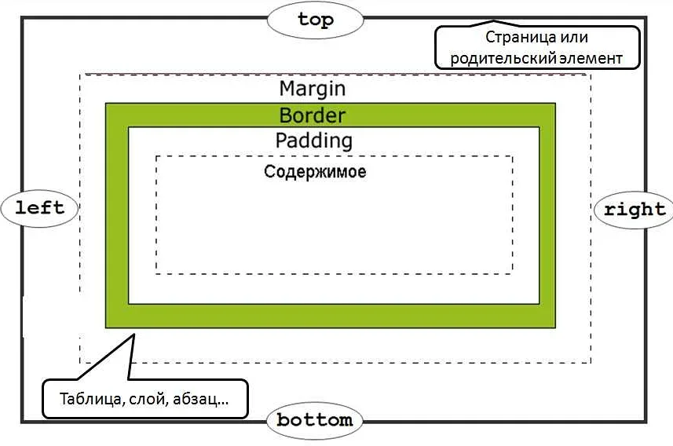
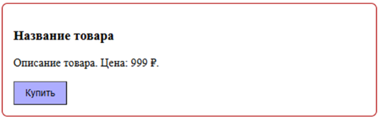

Все задания по вебу выполняются в одном файле, стили приписываем в тэге style в шапке 

НАВИГАЦИЯ
* [Базовая структура](#1)
* [Задание 1](#2)
* [Задание 2](#3)


# <a id='1'>Базовая структура</a> 
1) Что бы создать базовую структуру страницы, ставим ! и тыкаем enter
```
<!DOCTYPE html>
<html lang="en">
<head>
    <meta charset="UTF-8">
    <meta name="viewport" content="width=device-width, initial-scale=1.0">
    <title>Document</title>
</head>
<body>
    
</body>
</html>
```

↑ вот что должно получиться

2) Далее под основное тело html (под тэг body) кидаем тэг style

```
<!DOCTYPE html>
<html lang="en">
<head>
    <meta charset="UTF-8">
    <meta name="viewport" content="width=device-width, initial-scale=1.0">
    <title>Document</title>
    
</head>
<body>
    
</body>
<style></style> ← вот он
</html>
```

# <a id='2'>Задание 1</a>
Необходимо сделать так, чтобы только элементы «Пункт 2» и «Пункт 3» были красными, 
и с нижними отступами между элементами. А вокруг списка должна быть пунктирная рамка (цвет: blueviolet) 
с кругленными краями (dashed)



```
<!DOCTYPE html>
<body>
  	<ul>
        <li>Пункт 1</li>
        <li>Пункт 2</li>
        <li>Пункт 3</li>
        <li>Пункт 4</li>
      </ul>
</body>
<style>
li {
  color: black;
}
</style>
```

↑ В задании дана базовая структура. у нас есть неупорядоченный список (ul).  
Первое, что нужно сделать - проставим классы на теги li, что бы разделить красные элементы и черные, и класс на тэг ul, чтобы было)   
Пусть черные будут point, а красные - colored_point.  
Так же добавим в тэг style три класса: вместо li - li.colored_point и li.point, и ul.list. Можно написать просто .point, .colored_point и .list, разницы никакой.  

```
<!DOCTYPE html>
<html lang="en">
    <head>
        <meta charset="UTF-8">
        <meta name="viewport" content="width=device-width, initial-scale=1.0">
        <title>Document</title>
    </head>
    <body>
        <ul class="list">
            <li class="point">Пункт 1</li>   ← изменение
            <li class="colored_point">Пункт 2</li>   ← изменение
            <li class="point">Пункт 3</li>   ← изменение
            <li class="colored_point">Пункт 4</li>   ← изменение
        </ul>
    </body>
    <style>
        li.point{  ← изменение
        }
        li.colored_point{  ← изменение
        }
        ul.list{  ← изменение
        }
    </style>
</html>
```


Коротко об отступах  
у каждого элемента есть рамка - border, мы можем задать ей размер, цвет и другие параметры. пространство за пределами рамки - margin. пространство внутри рамки - padding. соотвественно у каждого из этих параметров есть верх, низ, право и лево (top, bottom, right, left). что бы назначить разные отступы а одном параметре можем использовать конструкцию параметр: верх право низ лево;
прим.: margin-top: 2 px - верхний внешний отступ 2 px от другого элемента   
прим.: margin: 2px 3px 0px 3px - верхний внешний отступ 2px, левый и правый внешние отступы по 3px, нижний внешний отступ 0px


Накинем цвет и нижние отступы между элементами на li и рамку на list в стили
```
    <style>
        li.point{
            color: black;
            margin-bottom: 4px
        }
        li.colored_point{
            color: red;
            margin-bottom: 4px
        }
        ul.list{
            border: 2px dashed blueviolet; 
            <!-- dashed - прерывистая рамка -->
            border-radius: 8px;
        }
    </style>
```

можно еще сделать вот так
```
    <style>
        li{
            margin-bottom: 10px;  
        }
        li.point{
            color: black;
        }
        li.colored_point{
            color: red;
        }
        .list{
            border: 2px dashed blueviolet;
            border-radius: 8px;
        }
    </style>
```


# <a id='3'>Задание 2</a>
Поправить карточку товара, так чтобы у карточки появилась рамка (#af0000), внутренние отступы карточки, и были скруглены углы рамки.   А также кнопка была сиреневого цвета (rgb(173, 173, 255)) и внутренние отступы (8px 16px).



```
<!DOCTYPE html>
<body>
	<div>
    	<h3>Название товара</h3>
    	<p>Описание товара. Цена: 999 ₽.</p>
        <div>
            <button>Купить</button>
        </div>
    </div>
</body>
```
↑ Дана базовая структура, есть контейнер div, внутри которого заголовок h3, параграф p, и еще один контейнер и кнопкой button.

Надо сделать рамку и установить цвет и отступы кнопке, а значит надо поработать с кнопкой и внешним большим контейнером всей карточки.  
Добавим классы на первый div и на button

```
    <div class="card">
        <h3>Название товара</h3>
        <p>Описание товара. Цена: 999 р.</p>
        <div>
            <button class="buy_button">Купить</button>
        </div>
    </div>
```

накинем стили на div. необходимо сделать скругленную рамку цвета #af0000 и внутренние отступы

```
    .card{
        border: 2px solid #af0000;
        border-radius: 5px;
        padding: 30px;
    }
```

Теперь поработаем с кнопкой  
Нужное ее раскрасить в цвет rgb(173, 173, 255) и сделать внутренние отступы (8px 16px)  
Насколько я поняла отступы либо верх-право, либо лево-право. Скорее всего лево-право, так что пусть будет так

```
    .buy_button{
        background-color: rgb(173, 173, 255);
        padding-left: 8px;
        padding-right: 16px;
    }
```

Всё, готово

